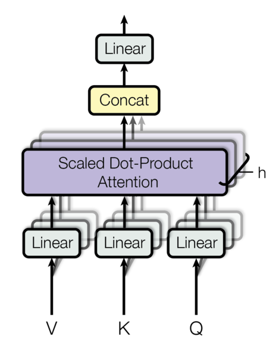

- Paper: https://arxiv.org/pdf/1706.03762
- The Annotated Transformer: https://nlp.seas.harvard.edu/annotated-transformer/
- This was getting very long so it is split it up into different sections. 
- This is the *Attention* part of the series.
#### Intro
- This paper implementation post is a bit different from previous posts in a sense that I mainly follow the code from the **Annotated Transformer** cited above instead of starting from scratch. 
- The reason for doing so is due to its significance. I simply don't want to get anything even slighly incorrect and also want to follow its most accurate and efficient implementation.
- I've read this paper previously, studied it in school, and also implemented it once but I've always felt that students, including myself, have more of a high-level understanding/intuition of it rather than really understanding it fully.
- So this post is to really go over even the smallest detail at every step and also to try to explain "why" it works and hopefully it makes sense for everyone.

#### Attention Mechanism (Self-Attention)

- As the paper title "Attention is All You Need" suggests, attention is the heart of the Transformer architecture. So what is attention and why does it work? 
- Mathematically, the **Scaled** (division by $\sqrt{d_{k}}$) **Dot-Product** (dot-product between $Q$ and $K$) attention function is defined as: $Attention(Q, K, V) = softmax(\frac{QK^{T}}{\sqrt{d_{k}}})V$
- Where $Q, K, V$ corresponds to the Query, Key, and Value matrices, and $\sqrt{d_{k}}$ corresponds to the dimension of $K$. 
- The common explanation is that the $Q$ maps to a specific $K$ and measures the similarity between $Q$ and $K$, which is then transformed into probabilities through the $softmax$ function. Then these probabilities serves as weights/scores for $V$ for learning. 
- Unfortunately this explanation provides what attention does but not really why it works. 
- To dive deeper, say we have a sentence *"Attention is cool"* and we represent it with an embedding size of 4. This sentence will have its corresponding $Q, K, V$ vectors with the shape of $[1, 3, 4]$, assumming a batch size of 1.
```py
# Attention is cool -> [1, 3, 4]
batch_size = 1
seq_len = 3
d_k = 4

Q = torch.randn(batch_size, seq_len, d_k)
K = torch.randn(batch_size, seq_len, d_k)
V = torch.randn(batch_size, seq_len, d_k)
```
- The example above is an illustrated example but in practice it may look closer to: 
```py
sent = ["Attention", "is", "cool"] 
# Assume our tokenizer just a 3 word dictionary
tokenizer = {"Attention": 0, "is": 1, "cool": 2}
tokens = torch.tensor([tokenizer[word] for word in sent]).unsqueeze(0)  # change to tensor and add batch dim 1 at index 0
```
- Here, ```tokens``` would be $[[0, 1 , 2]]$ with a shape of $[1, 3]$.
- Now we define the embedding layer to transform our tokenized sentence to embeddings of size 4.
```py
embedder = nn.Embedding(num_embeddings=len(tokenizer), embedding_dim=4)
embedded_sent = embedder(tokens)
```
- At this step, we have ```embedded_sent``` with a shape of $[1,3,4]$.
- In practice, these embedded sentences are run through differnt linear layers to get to $Q,K,V$, which allows them to learn different representations for each $Q, K, V$.
- I will go into more detail later but for now, assume that the layers have the same dimensions ($4$) as the sentence embedding.
```py
# Linear layers to transform Q,K,V into inputs to attention
d_k = 4
Q_linear = nn.Linear(d_k, d_k)
K_linear = nn.Linear(d_k, d_k)
V_linear = nn.Linear(d_k, d_k) 

Q = Q_linear(embedded_sent) # [1, 3, 4]
K = K_linear(embedded_sent) # [1, 3, 4]
V = V_linear(embedded_sent) # [1, 3, 4]
```
- Now, to see how this actually works, I'll implement a very simple attention function mentioned below: $Attention(Q, K, V) = softmax(\frac{QK^{T}}{\sqrt{d_{k}}})V$

```py
def attention(Q, K, V):

    d_k = Q.size(-1) # last dimension of Q (shape of hidden layer/embedding)

    attn_scores = torch.matmul(Q, K.transpose(-1, -2)) / math.sqrt(d_k) # this is the weights part

    attn_probs = attn_scores.softmax(dim=-1) # want to take softmax across embedding dim

    return torch.matmul(attn_probs, V) # final attention function output
```
- Let's try to see what the outputs of attention look like at each step.
- We can observe that our ```attn_scores``` have the shape of $[1, 3,3]$ as we multiplied $Q$ with a shape of $[1, 3,4]$ with $K^{T}$, which is $[1, 4,3]$. 
- These are the raw numbers (logits) of our dot-product similarity score, but it's not really interpretable for at least at this point. The only thing is that larger numbers are probably more likely but we'll see for sure when we transform them into probabilities.
```
>>> attn_scores = 
tensor([[[-0.4478, -0.0182, -0.4006],
         [-0.2950, -0.0614, -0.5863],
         [-0.3634,  0.0023, -0.6501]]], grad_fn=<DivBackward0>)
```
- Now, we can see that the $softmax$ function transformed the scores into probabilities, in other words, we are asking given $Q$, what are the probabilities that it is most similiar to $K$?
- In our example, the first word **"Attention"** in its first row, looks at itself with a probability of $0.2789$, **"is"** with a proability of $0.4286$, and **"cool"** with $0.2924$.
- At the moment, the probabilities don't mean anything as the embeddings are randomized and we are not learning anything but we'll see how that changes as we train the model.
- P.S. if you forgot about the softmax function, it converts logits into probabilities: $softmax(z_{i}) = \frac{e^{z_{i}}}{\sum{e^{z_{i}}}}$.

```
>>> attn_probs = 
tensor([[[0.2789, 0.4286, 0.2924],
         [0.3322, 0.4196, 0.2482],
         [0.3133, 0.4516, 0.2352]]], grad_fn=<SoftmaxBackward0>)
```
- Now, the multiplication between the scores and $V$ gets us a $[1, 3, 4]$ matrix; as our ```attn_probs``` of shape $[1,3,3]$ was multiplied by $V$ with a shape of $[1,3,4]$.
- At this point, the most important thing to notice is that at the previous step (```attn_probs```), we compared words with each other through probabilities. In fact, the matrix was in the form of ```[seq_len, seq_len]```; so that **each word looks at one another** to understand the **relationship** with them.
- Now we multiply ```attn_probs``` to $V$ (caryying raw **meaning** about the word through its embeddings), allowing us to **combine the relationship of the words with each other and also the meaning of what each word actually represents**.  
- Again, note that final matrix is in the form of ```[seq_len, d_k]``` again, so each row represents the word with the columns representing the meaning but also information w.r.t other words in the sentence. 
- In our example **"Attention is cool"**, the raw embeddings in the word **"cool"** may contain meanings similiar to "cold", "winter', "drink", "awesome". However, by providing context of its relationship to the sentence (e.g "Attention") it may learn to focus on the meaning of "awesome" and ignore meanings such as "cold", "winter", "drink".
- Looking at our ```attn``` matrix, we can imagine that for the last row("cool"), the columns represents these features ("cold", "winter', "drink", "awesome") and through attention, we learn to prioritize the last column.
```
>>> attn = 
tensor([[[-0.3229, -0.7989, -0.8596,  0.2613],
         [-0.3294, -0.8030, -0.8922,  0.2746],
         [-0.3343, -0.7966, -0.8509,  0.2528]]], grad_fn=<UnsafeViewBackward0>)

```
- Hopefully, this gives a solid understanding of how attention works and especially how it captures contextual information based on combining the attention scores/probabilities from the $Q, K$ pair and also meaning from $V$. 
- However, if the sentence gets longer and more complicated, say **"Attention is very cool, and it is also fun to learn"**, we might need more than one attention mechanism to capture the context of specific words. For example, not only might we want to learn the context of **"cool"** with respect to **"Attention"**, we might also want to learn its relationship to adverbs such as **"very"**. 
- In order to address this problem, we would now introduce Multi-Head Attention.

#### Multi-Headed Attention 

- For Multi-Headed Attention, we refer to each attention block that we discussed above as an **Attention Head**.
- In the case of a single attention head, averaging across different relationships can dilute a wide range of different relationships; we use multiple attention heads to capture more diverse range of representations. 
- Multi-Headed Attention can be formally defined as: 
> $MultiHead(Q, K, V) = Concat(head_{1}, ... head_{h})W^{O}$ 
> $head_{i} = Attention(QW_{i}^{Q}, KW_{i}^{K}, VW_{i}^{V})$
- $h$ :  Number of Heads
- $W^{O} \in \Reals^{hd_{v} \times d_{model}}$
- $W_{i}^{Q} \in \Reals^{d_{model} \times d_{k}}$
- $W_{i}^{K} \in \Reals^{d_{model} \times d_{k}}$
- $W_{i}^{V} \in \Reals^{d_{model} \times d_{V}}$

- Note that for a single attention head, $Q \in \Reals^{len_{seq} \times d_{k}}$, $K \in \Reals^{len_{seq} \times d_{k}}$, $Q \in \Reals^{len_{seq} \times d_{v}}$; so $d_{k} = d_{model}$.
- However, we are now using $h$ number of heads of $d_{k}$, where $h \times d_{k} = d_{model}$ for multi-headed attention, so $Q \in \Reals^{len_{seq} \times d_{model}}$, $K \in \Reals^{len_{seq} \times d_{model}}$, $V \in \Reals^{len_{seq} \times d_{model}}$


```py
def clones(module, N):
    "Produce N identical layers."
    return nn.ModuleList([copy.deepcopy(module) for _ in range(N)])

class MultiHeadedAttention(nn.Module):
    def __init__(self, num_heads, d_model):
        super().__init__()
        self.num_heads = num_heads
        self.d_k = d_model // num_heads
        self.projections = clones(nn.Linear(d_model, d_model), 4)

    def forward(self, query, key, value):
        nbatches = query.size(0)

        # Do all the linear projections in batch from dim: d_model -> d_model -> (num_heads, d_k)
        query, key, value = [
            projection(x).view(nbatches, -1, self.h, self.d_k).transpose(1, 2)
            for projection, x in zip(self.projections, (query, key, value))
        ]

        # Apply attention on all the projected vectors in batch.
        x, self.attn = attention(query, key, value)

        # Concat and return to dim: d_model
        x = x.transpose(1, 2).contiguous().view(nbatches, -1, self.h * self.d_k)
        del query
        del key
        del value
        return self.linears[-1](x)
```
- Going line by line, in  ```__init__()``` we see that we defined ```self.projections``` as 4 ```nn.Linear()``` layers. These 4 layrs represents $W^{Q},W^{K},W^{V}$ that are used to project $Q, K, V$, and also the output of attention, so $W^{O}$.
- In ```forward()```, we see $Q, K, V$ are passed through the linear layers through ```projection(x)```.
- The dimension output at this case would be ```[batch_size, len_seq, d_model]``` at this stage; however, we want to split this dimension into $h$ heads, so we use ```.view()``` to reshape the last dimension ```d_model``` and split it into ```[self.h, self.d_k]``` as we mentioned above ```d_model = h * d_k```. Lastly, we include ```-1``` in ```.view()``` as ```-1``` means to fill in whatever is left, which should be ```len_seq```. Lastly, we transpose the output to a more desirable shape of ```[batch_size, num_heads, seq_len, d_k]```. 
- At this point, we apply the same attention function as before, but with different heads.
- Lastly, we transpose back to our original dimension, also equivalent as the **concat** step in the diagram above then pass it through the last output linear layer $W^{O}$.

#### Conclusion
- Hopefully this gives a good understanding of how attention works, if it is still confusing, try to create random tensors or follow to code to see how the weights or matrices change. Following the dimensions of the matrices also seem to be very helpful. 
- The key takeaway is that attention allows to capture context of the sentence by combining **Attention Scores/Weights**```[seq_len, seq_len]```(looking at other words) and embedding/meaning of the actual words ```[seq_len, dim_k]```.
- The next post would be on the actual transformer architecture. 