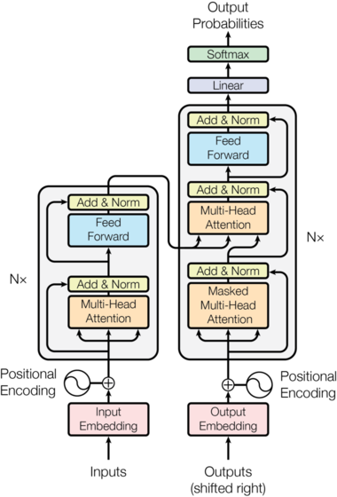

- Paper: https://arxiv.org/pdf/1706.03762
- The Annotated Transformer: https://nlp.seas.harvard.edu/annotated-transformer/
- This is the *Transformer* part of the series.
- Let's dive right into Transformers continuing from the previous post.

### Transformer Architecture
- Assuming we now understand how Multi-Head Attention work, let's try to implement the actual architecture of the model. 

- Here we first predefine the ```LayerNorm``` module from my previous post; though here they added learnable coefficients for the output of the layer norm: ```a_2```, ```b_2```.
```py
class LayerNorm(nn.Module):
    def __init__(self, features, eps=1e-6):
        super().__init__()
        self.eps = eps
        self.a_2 = nn.Parameter(torch.ones(features))
        self.b_2 = nn.Parameter(torch.zeros(features))

    def forward(self, x):
        batch_size, length, feature_dim = x.shape
        output = torch.zeros_like(x)

        # dim=-1 so we squish along last idx(feature_dim)
        # keep_dim=True so we get (batch_size, length, 1)
        mu = x.mean(dim=-1, keep_dim=True)
        var = x.var(dim=-1, keep_dim=True)

        output = self.a_2 * (x - mu) / torch.sqrt(var + self.eps) + self.b_2

        return output
```

- The left block of the architecture is called the **encoder** and we will start from here.

#### Encoder
- If you look at the encoder, there are $N \times$ for each of the blocks in the architecture, which stands for needing multiple copies of those blocks. We use the iterator pattern + ```nn.ModuleList``` here to do so.
- If you are not familiar with ```nn.ModuleList```, it's a way to store a list of ```nn.Module```, which is if you recall the is ```ABC```(Abstract Base Class) that we inherit when creating PyTorch models.
- We also conduct a ```LayerNorm``` for the output of the encoder block. 
```py
class Encoder(nn.Module):
    def __init__(self, layer, N):
        super().__init__()
        self.layers = nn.ModuleList([copy.deepcopy(layer) for _ in range(N)])
        self.norm = nn.LayerNorm(layer.size)

    def forward(self, x, mask=None):
        for layer in self.layers:
            x = layer(x, mask)
        return self.norm(x)
```
- *Note* that in the diagram, the  ```LayerNorm()``` goes after the sublayers, which is called **Post-LayerNorm**. However, more recent implementations use **Pre-LayerNorm**, which means that it is applied before the sublayer, which is what we follow here.
- We can also notice that there is a **skip-connection** right after the Multi-Head-Attention block, which we actually implemented from the ResNet paper before!
- After the MHA block, we pass it to the feed forward sublayer at this point.
- At this point, a something you should be thinking of is the dimensions at each pass through the encoder.
```py
class EncoderLayer(nn.Module):
    def __init__(self, size, self_attn, feed_forward, dropout):
        super().__init__()
        self.self_attn = self_attn
        self.feed_forward = feed_forward
        self.size = size
        
        self.norm1 = nn.LayerNorm(size)
        self.norm2 = nn.LayerNorm(size)
        self.dropout = nn.Dropout(dropout)

    def forward(self, x, mask):
        # Multi-Head-Attention Sublayer (Pre-LN)
        norm_x = self.norm1(x)
        attn_out = self.self_attn(norm_x, norm_x, norm_x, mask)
        # Notice this is the residual/skip connection from ResNet!
        x = x + self.dropout(attn_out)

        # Feed Forward Sublayer (Pre-LN)
        norm_x = self.norm2(x)
        ff_out = self.feed_forward(norm_x)
        x = x + self.dropout(ff_out)
        
        return x
```
- So let's go through it as an example. Say our input embeddings are in the shape ```[batch, seq_len, emb_len]``` or ```[32, 128, 512]``` if numbers makes more sense.
- When we conduct ```LayerNorm``` on ```x```. ```LayerNorm``` actually returns the same dimension as its input so we're still at ```[batch, seq_len, emb_len]``` after the first ```self.norm1(x)```.
- Now we pass this through our MHA block. We know that our attention output from the MHA block is actually identical to its input dimension so it's still at ```[batch, seq_len, emb_len]```!
- The feedforward network is a bit different, which we will explain here. 
#### FeedForward Networks (FFN)
- The FFN is applied in both the Encoder and Decoder block and consists of two linear transformations with a ```ReLU()``` in between. The dimension goes from ```d_model``` to ```d_ff``` back to ```d_model```, where ```d_ff``` is much larger than ```d_model```. 
- What we achieve with FNN is: Based on the new features that contain context that we learned from attention, we project these features into a higher dimension and try to learn the features, then compress the information back. 
- Ultimately, because the attention mechanism is a Linear Combination, we need to introduce Non-Linearity to approximate non-linear patterns that lie in the feature space.
```py
class PositionwiseFeedForward(nn.Module):
    def __init__(self, d_model, d_ff, dropout=0.1):
        super().__init__()
        self.w_1 = nn.Linear(d_model, d_ff)
        self.w_2 = nn.Linear(d_ff, d_model)
        self.dropout = nn.Dropout(dropout)

    def forward(self, x):
        return self.w_2(self.dropout(self.w_1(x).relu()))
```
- But back to the dimensions, because we the input dimension is equal to the output dimension of the FNN, we would get ```[batch, seq_len, emb_len]``` as the output of the encoder.

#### Positional Encoding (PE)
- Talking about position-wise FFN, we also have to mention the positional encoding part of the input of the model. 
- Because we are processing the embeddings in parallel, unlike a RNN, we don't have a sense of sequence of the data. Therefore, we need to add something to make sure the positions of the words are preserved for the words in the sentence.
- We use sinusoidal functions to represent this quality. Here is a great [blog post](https://huggingface.co/blog/designing-positional-encoding) from HF that explains PE in detail that I recommend you to take a look. 
- But in summary, 

> $PE_{(pos,2i)} = sin(w_{i} (pos))$
> $PE_{(pos,2i+1)} = cos(w_{i} (pos))$

- where $w_{i} = \frac{1}{10000^{{2i}/{d_{model}}}}$ and $i$ represents the embedding dimension, and $pos$ the position in the sentence.
- To have an understanding of how this works, note that $w_{i}$ is decreasing as $i$ increases.
- Therefore, for different values of $i$, the frequency of the sinusoidal functions ($w_{i}$) will be unique; allowing each position to have a unique positional vector of values between 0 and 1 assigned to them.
- Then, for a single $pos$, we have a vector of $i$ different values that are added to the original input embeddings.
- But how do these embeddings actually capture the meaning of position of the words and won't it dilute the actual context of the original embeddings $x$ for attention?
- The full proof is in the [blog post](https://huggingface.co/blog/designing-positional-encoding) but when we actually compute the attention score between the two embeddings at $pos$ and $pos + k$, the resulting transformation gives $PE(pos +k) = M_{k} \cdot PE(pos)$, where $M_{k}$ is a rotation matrix that only depends on $k$, not on $pos$.
- And the thing is when we actually calculate attention, we do $Q \cdot K^{T}$; if you recall from linear algebra, dot products can be represented as: $a \cdot b = |a||b| cos(\theta)$. 
- Therefore, the norms of the two vectors are completely preserved and $M_{k}$ only corresponds to the $cos(\theta)$ of the rotation/angle between the vectors, meaning that the attention score actually **depends solely on the relative rotation/distance between the words not on the absolute position**! 
- I thought this was pretty cool and this intuition of rotation actually leads to other methods for positional encoding (RoPE) but we'll stick with sines and cosines for now.
- The actual code to implementing this is copied below. 
- Note that PEs have ```.requires_grad_(False)```, so they are not learnable parameters but we need to store them later when decoding, which is why we store them as a ```buffer```.
```py
class PositionalEncoding(nn.Module):
    def __init__(self, d_model, dropout, max_len=5000):
        super().__init__()
        self.dropout = nn.Dropout(p=dropout)

        # Compute the positional encodings once in log space.
        pe = torch.zeros(max_len, d_model)
        position = torch.arange(0, max_len).unsqueeze(1)
        div_term = torch.exp(
            torch.arange(0, d_model, 2) * -(math.log(10000.0) / d_model)
        )
        pe[:, 0::2] = torch.sin(position * div_term)
        pe[:, 1::2] = torch.cos(position * div_term)
        pe = pe.unsqueeze(0)
        self.register_buffer("pe", pe)

    def forward(self, x):
        x = x + self.pe[:, : x.size(1)].requires_grad_(False)
        return self.dropout(x)
```
- Now let's look at the block in the right, which is actually not too different compared to the encoder.
#### Decoder
```py
class Decoder(nn.Module):
    def __init__(self, layer, N):
        super().__init__()
        self.layers = nn.ModuleList([copy.deepcopy(layer) for _ in range(N)])
        self.norm = LayerNorm(layer.size)

    def forward(self, x, memory, src_mask, tgt_mask):
        for layer in self.layers:
            x = layer(x, memory, src_mask, tgt_mask)
        return self.norm(x)
```
- The decoder has a very similiar structure to the encoder, but includes memory and some masking.
- Here the ```memory``` stands for the output of the decoder, and we have ```src_mask``` and ```tgt_mask```, which represents masked inputs, which we will cover now.
#### Masking
- For the decoder, when training, we want to ensure that the model is not seeing the entire sentance during training. 
- Instead, we want to evaluate its performance by predicting the sequence one-by-one in order. Therefore, we pass a mask before the ```softmax()``` function in order to prevent access to the next token. 
- In the code below, the logic goes as: ( matrix of 1 ) $\rightarrow$ ( upper triangular matrix of 1 with 0s on the diagonal ) $\rightarrow$ ( True if value is 0 so all 0 become 1 ) $\rightarrow$ ( lower triangular matrix of 1 )
```py
def subsequent_mask(size):
    attn_shape = (1, size, size)
    subsequent_mask = torch.triu(torch.ones(attn_shape), diagonal=1).type(
        torch.uint8
    )
    return subsequent_mask == 0
```
- Note that due to the introduction of masks, we need to change the attention logic to be able to work with masks. 
- Continuing the code from the *Attention* post, we notice we replace all the $0$ with ```-1e9```, which may seem a bit strange. 
- If you recall ```softmax()``` again, $softmax(z_{i}) = \frac{e^{z_{i}}}{\sum{e^{z_{i}}}}$.
- If we have $0$ as the masked parts, we don't actually end up obtaining probabilities after the ```softmax()``` as $e^{0} = 1$, meaning that masked words actually get a non-zero attention score. 
- Therefore, we fix the masks as very small values, as $\lim_{x \rightarrow -\infty} e^{x} = 0$ in order to mask the words when it passes the ```softmax```.
```py
def attention(Q, K, V, mask=None):
    d_k = Q.size(-1) 
    attn_scores = torch.matmul(Q, K.transpose(-1, -2)) / math.sqrt(d_k) 

    # this is the new masks part
    if mask is not None:
        attn_scores = attn_scores.masked_fill(mask == 0, -1e9)

    attn_probs = attn_scores.softmax(dim=-1) 
    return torch.matmul(attn_probs, V) 
```
- Now back to the DecoderLayer. 
#### Decoder Layer
```py
class DecoderLayer(nn.Module):
    def __init__(self, size, self_attn, src_attn, feed_forward, dropout):
        super().__init__()
        self.size = size
        self.self_attn = self_attn
        self.src_attn = src_attn

        self.norm1 = nn.LayerNorm(size)
        self.norm2 = nn.LayerNorm(size)
        self.norm3 = nn.LayerNorm(size)
    
        self.feed_forward = feed_forward

    def forward(self, x, memory, src_mask, tgt_mask):
        # Multi-Head-Attention Sublayer (Pre-LN)
        norm_x = self.norm1(x)
        self_attn_out = self.self_attn(norm_x, norm_x, norm_x, tgt_mask)
        x = x + self.dropout(self_attn_out)

        # Multi-Headed-Attention Sublayer with memory from Encoder
        norm_x2 = self.norm2(x)
        cross_attn_out = self.src_attn(norm_x2, memory, memory, src_mask)
        x = x + self.dropout(cross_attn_out)

        # FFN sublayer
        norm_x3 = self.norm3(x)
        ff_out = self.feed_forward(norm_x3)
        return x + self.dropout(ff_out)
```
- And now, we have all the building blocks to make the entire transformer architecture! 

```py
def make_model(
    src_vocab, tgt_vocab, N=6, d_model=512, d_ff=2048, h=8, dropout=0.1
):
    c = copy.deepcopy
    attn = MultiHeadedAttention(h, d_model)
    ff = PositionwiseFeedForward(d_model, d_ff, dropout)
    position = PositionalEncoding(d_model, dropout)
    model = EncoderDecoder(
        Encoder(EncoderLayer(d_model, c(attn), c(ff), dropout), N),
        Decoder(DecoderLayer(d_model, c(attn), c(attn), c(ff), dropout), N),
        nn.Sequential(Embeddings(d_model, src_vocab), c(position)),
        nn.Sequential(Embeddings(d_model, tgt_vocab), c(position)),
        Generator(d_model, tgt_vocab),
    )

    return model
```
- Hope this helps understand how the transformer architecture is established!
- For details on training, make sure to check out [Annotated Transformer](https://nlp.seas.harvard.edu/annotated-transformer/).